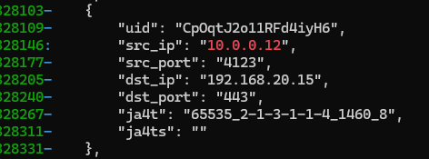
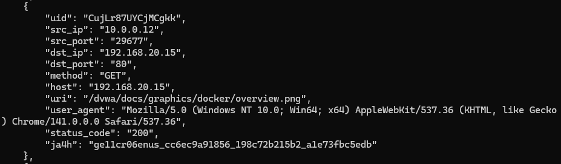
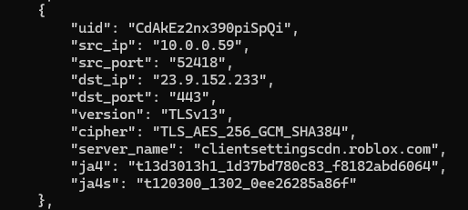

# JA4+ Zeek Plugin scripts for data extraction
This repo will be used to share my research regarding the JA4+ plugin on Zeek 7.0.8, Python3, Wireshark 4.4

All information obtained is directly from Foxio under their license. Please see: https://github.com/FoxIO-LLC/ja4?tab=readme-ov-file#running-ja4 for more information. This repository is for research purposes only. 

🐘 Zeek JA4+ Fingerprint Extraction Scripts
Introduction
This repository contains a suite of Python scripts developed as a personal project to enhance the usability and data accessibility of the JA4+ fingerprinting capabilities integrated within a Zeek network security monitor environment.

The official JA4+ Zeek Plugin successfully calculates various JA4+ fingerprints (JA4, JA4S, JA4T, JA4TS, JA4H, JA4X) by modifying standard Zeek logs (e.g., conn.log, ssl.log, http.log, x509.log). These scripts parse the resulting extended Zeek log files, extract the relevant connection details and fingerprints, and output the structured data into user-friendly CSV and JSON formats.

The primary goal of this project is to create an easy, manual process for pulling out key JA4+ data on demand for threat hunting, baselining, and analysis. Future plans include automating these scripts for scheduled, hourly data extraction.

# Please see man_pages for a demonstration on how to use these scripts

For Ja4TCP example output: 

For Ja4HTTP example output: 

For Ja4 & Ja4s TLS example output:

